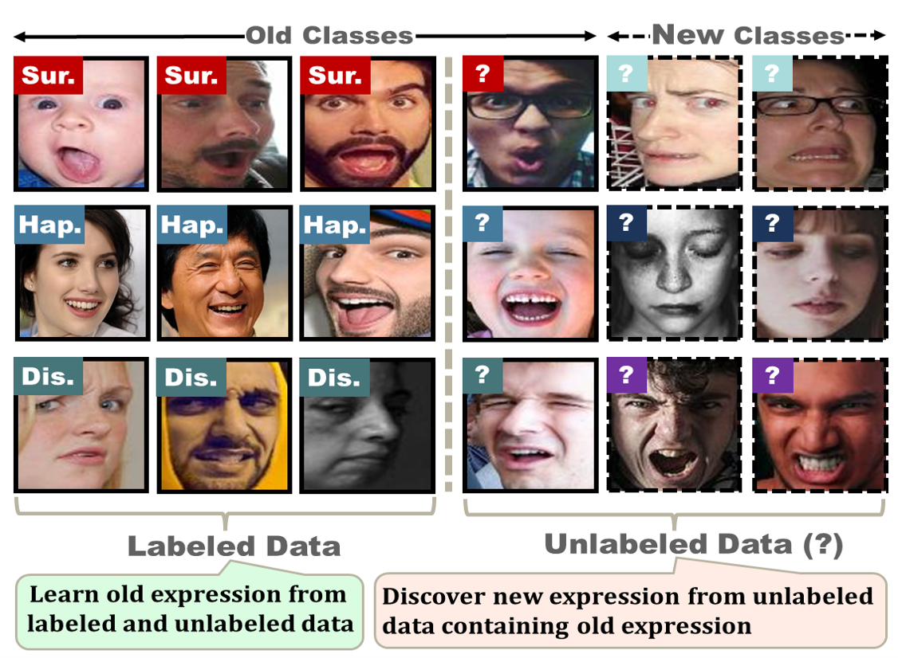
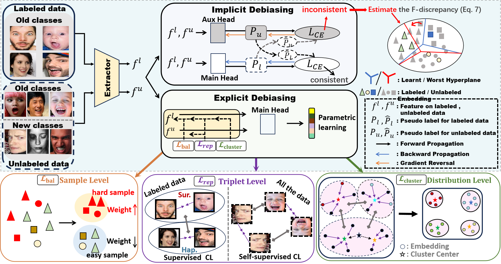

# Task: G-FACE



## DIG-FACE: De-biased Learning for Generalized Facial Expression Category Discovery


We introduce a novel task, Generalized FAcial expressionCategory discovEry (G-FACE), 
that discovers new, unseen facial expressions while recognizing known categories effectively. 
Even though there are generalized category discovery methods for natural images, they show compromised performance on G-FACE. We identified two biases that affect the learning: 
implicit bias, coming from an underlying distributional gap between new categories in unlabeled data and known categories in labeled data, and explicit bias, coming from shifted preference on explicit visual facial change characteristics from known expressions to unknown expressions. By addressing the challenges caused by both biases, we propose a Debiased G-FACE method, namely DIG-FACE, that facilitates the de-biasing of both implicit and explicit biases. In the implicit debiasing process of DIG-FACE, we devise a novel learning strategy that aims at estimating and minimizing the upper bound of implicit bias. In the explicit debiasing process, we optimize the model’s ability to handle nuanced visual facial expression data by introducing a hierarchical  category-discrimination refinement strategy: sample-level, triplet-level, and distribution-level optimizations. Extensive experiments demonstrate that our DIG-FACE significantly enhances recognition accuracy for both known and new categories, setting a first-of-its-kind standard for the task.  




## Running

### Dependencies

```
pip install -r requirements.txt
```
